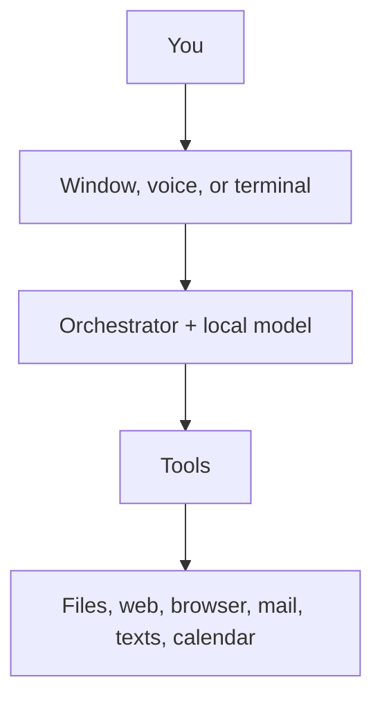

# Arelis

*(say it "ah-REL-is")*

Arelis is an assistant that lives on your own PC. She has a desktop window you
talk or type into, she thinks using models running on your own graphics card,
and she can actually do things — read your files, search the web, drive her own
browser window, send mail and texts, keep your calendar, and remember what you
told her last week.

The part that makes her different from a chatbot in a browser tab is where she
runs. There is no account. There is no server holding your conversations. If
your internet goes down, she still works.



## What Arelis will not do

This is the short version of a rule the code is built around: **nothing about
you leaves your machine unless you pointed it somewhere yourself.**

- No account, no sign-up, no profile on anyone's server.
- No analytics, no telemetry, no "anonymous" usage statistics.
- No crash report is sent anywhere. If something breaks, Arelis prepares a
  report and shows it to you; sending it is your decision and your click.
- Your conversations, contacts and memory are files on your disk. You can read
  them, back them up, or delete them, without asking anybody.

The only things she connects to are the ones you asked for: the model running
on your own machine, a web search when you ask a question, your mail provider
when you send mail. That list is pinned by a test, so a future change that adds
a new destination fails the build rather than shipping quietly.

She also asks before acting. Writing a file, sending a message, driving the
browser, remembering something permanently — each one shows a card, and nothing
happens until you allow it. She will not send texts or mail while you are away
from the keyboard.

## Installing

**An installer is coming, and it is not ready yet.** When it is, this section
will say "download this, run it", and everything below will be its problem
rather than yours. Until then Arelis runs from source, which means the steps
below are honest about what they are: a developer install.

You will need [Python 3.11 or newer](https://www.python.org/downloads/) and
[Ollama](https://ollama.com/download), which is what runs the models on your
machine.

Get the models. This downloads several gigabytes, once:

```powershell
ollama pull qwen2.5:7b
ollama pull qwen2.5:14b
ollama pull qwen2.5-coder:7b
ollama pull nomic-embed-text
```

Then set up Arelis itself:

```powershell
python -m venv .venv
.\.venv\Scripts\Activate.ps1
pip install -e .
```

Two optional extras, each worth having:

```powershell
pip install -e ".[voice]"      # talking and listening
pip install -e ".[browser]"    # her own browser window
playwright install chromium
```

## Running

```powershell
.\scripts\run_ui.ps1
```

or just `arelis` once the environment is active. There is a terminal version
too, `arelis --cli`, and a background mode that keeps receiving your phone's
texts with no window open, `.\scripts\run_core.ps1`.

To put an icon on your desktop:

```powershell
.\.venv\Scripts\python.exe scripts\generate_app_icon.py
.\scripts\install_desktop_shortcut.ps1
```

## Setting her up

Three files under `data/` hold everything personal, and none of them are ever
part of the project. Copy the examples and fill in what you want:

| Copy this | To this | For |
|---|---|---|
| `data/profile.example.yaml` | `data/profile.yaml` | Your name, where you live, how you like answers |
| `data/contacts.example.yaml` | `data/contacts.yaml` | People she can text or email |
| `data/secrets.example.yaml` | `data/secrets.yaml` | Your mail login and similar |

Everything in `data/` stays on your disk and is excluded from the project by
default, so there is no way to commit it by accident.

## Using her

**The window.** With no conversation open you get the orbit — a ring with a
box under it. Type there. Once you send something you get the workbench: the
conversation, a composer at the bottom, and panels you can open for what she is
thinking, the files she is working with, your history, and notifications.

**Press F1** for every keyboard shortcut, and the version you are running.

**Roles.** Three settings for how hard she thinks, switchable in the composer
or with `/role fast`, `/role research`, `/role code`. Only one model sits on
your graphics card at a time, so switching costs a few seconds.

| Role | Model | Good for |
|---|---|---|
| `fast` | `qwen2.5:7b` | Normal conversation |
| `research` | `qwen2.5:14b` | Harder questions |
| `code` | `qwen2.5-coder:7b` | Programming |

**Her browser.** She does not touch your everyday browser, with your tabs and
your logins. She has her own window that you watch while she works, with stop
and pause controls on the Arelis side. She never types a password or a
one-time code, and she never clicks Book, Pay or Checkout — those are yours.

**Memory.** Things worth keeping live under Settings → Memory, and you can edit
or delete any of them. A dated backup lands in `data/backups/` every time she
starts, kept for a fortnight.

## What she can do

- Read and edit files in folders you have allowed
- Search the web and read pages properly, rather than guessing
- Drive her own browser: search, click, read a page, look something up on Maps
- Send mail, and email you a scheduled digest
- Keep a calendar, through Google, Outlook, or a plain local file
- Send and receive texts through your own Android phone
- Remember facts, goals and tasks, and give you a morning briefing
- Read text out of images and scanned documents
- Look at pictures and describe them, using a local vision model
- Generate images, if you have ComfyUI set up separately
- Listen and speak, with the voice extra installed

An honest caveat: all of this is covered by tests, but some of it — voice
timing, texts through a real handset, image generation — has only been run
end to end on the author's own hardware. If something behaves oddly on yours,
that is worth an issue rather than an assumption that you did it wrong.

## Digging deeper

| Document | What it covers |
|---|---|
| [architecture.md](docs/architecture.md) | How the whole thing is put together |
| [browser-control.md](docs/browser-control.md) | Her browser, and the limits on it |
| [notify-inbound.md](docs/notify-inbound.md) | Getting your phone's texts to your PC |
| [calendar-oauth.md](docs/calendar-oauth.md) | Connecting a calendar |
| [models.md](docs/models.md) | Which models she uses and why |
| [telemetry.md](docs/telemetry.md) | What gets logged, and where it stays |

## Contributing

See [CONTRIBUTING.md](CONTRIBUTING.md). One rule matters more than the rest:
nothing that identifies a real person goes in this repository, including in
test fixtures. That is enforced by a test rather than by trust.

## Licence

Arelis is free software under the
[GNU Affero General Public License, version 3 or later](LICENSE).

In plain terms: you can use it, read it, change it and share it. If you share a
changed version — including by running it as a service other people connect to
— you have to make your changes available under the same licence. It cannot be
taken closed.
