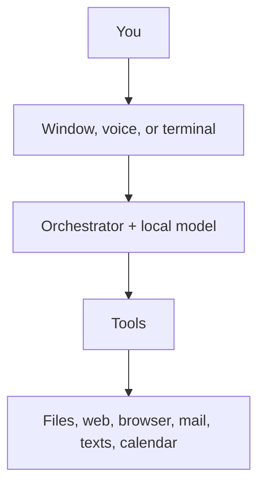

# Arelis

*(say it "ah-REL-is")*

Arelis lives on your Windows PC. A window you talk or type into. A mind that
runs on your graphics card. Hands that can read your files, search the web,
drive her own browser, send mail and texts, keep a calendar, and remember
work in named **rooms**.

No account. No server holding your chats. If the internet drops, she still
works.



## What she will not do

**Nothing about you leaves this machine unless you pointed it somewhere.**

No sign-up. No analytics. No crash report sent anywhere. Logs stay on your
disk. Conversations, contacts, and memory are ordinary files you can read,
back up, or delete.

She uses the network when you asked: search, weather, mail, a calendar you
connected, your own phone. An installed copy also asks GitHub once a day
whether a newer version exists. A source checkout never asks. Hosts are
pinned by a test, so a new destination fails the build.

Risky work pauses. A card, two lowercase buttons (**allow** / **deny**),
a headline like *text wife* or *write note.txt*. Mail and texts always show
the exact message. She will not send those while you are away from the
keyboard. Settings → Allow is the list.

## Installing

Windows 10 or later, 64-bit.

### The installer

Latest setup:
[GitHub releases](https://github.com/sAnct1x/arelis/releases/latest).
The current file is `Arelis-0.2.3-win64-setup.exe`. About 155 MB to
download, about 640 MB installed. Per-user, into
`%LOCALAPPDATA%\Programs\Arelis`. No administrator prompt.

It is **not code-signed.** SmartScreen will warn on first run. That is
Windows doing its job. Check the SHA-256 next to the installer:

```powershell
Get-FileHash .\Arelis-0.2.3-win64-setup.exe -Algorithm SHA256
Get-Content .\Arelis-0.2.3-win64-setup.exe.sha256
```

The hashes should match. That catches a bad download. It is not a signature.
Both files come from the same release.

The installer includes voice and her browser extra. It does not include the
models. First open she looks at this PC and recommends one chat model
(`qwen3.5:9b` on a typical 8–16 GB card). Confirm it, or pick Gemma or
DeepSeek. If [Ollama](https://ollama.com/download) is missing, she downloads
the free local engine first, about 1.4 GB, then the model. A vision model
(`qwen2.5vl:3b`) downloads the first time she looks at a picture.

From source, you can still pull by hand:

```powershell
ollama pull qwen3.5:9b
ollama pull nomic-embed-text
```

Ollama is system-wide. An older 0.2.2 install on the same PC still names
Qwen2.5 7B / 14B / Coder 7B. Do not delete those tags while that copy is
installed. Details: [models.md](docs/models.md).

Start **Arelis** from the Start menu. First open, she asks which folder she
may work in, then which model. An installed copy looks for updates. A
source checkout does not.

Installing does **not** copy a profile from this repository. The two copies
keep separate records on purpose.

How the installer is built: [win-installer/README.md](win-installer/README.md).

### From source

[Python 3.11+](https://www.python.org/downloads/) and Ollama, then:

```powershell
python -m venv .venv
.\.venv\Scripts\Activate.ps1
pip install -e .
```

Science tools (CAS, units, charts, arXiv, Horizons) come with that. NASA
APOD and NASA ADS need a free key in `data/secrets.yaml`. There is no pip
extra named `science`.

```powershell
pip install -e ".[voice]"      # talking and listening
pip install -e ".[browser]"    # her own browser window
playwright install chromium
```

```powershell
.\scripts\run_ui.ps1
```

Or `arelis` once the venv is active. Terminal: `arelis --cli`. Background
(phone ingest, no window): `.\scripts\run_core.ps1`.

Desktop icon from a checkout:

```powershell
.\scripts\install_desktop_shortcut.ps1
```

That writes **Arelis (dev)** so it cannot overwrite the installed **Arelis**
shortcut.

## Where your things live

First open, she asks which folder she may work in. She can change files
inside it and nowhere else.

| | Installed | What |
|---|---|---|
| The program | `%LOCALAPPDATA%\Programs\Arelis` | Replaced when she updates |
| Your records | `%LOCALAPPDATA%\Arelis` | Profile, contacts, mail login, memory, settings, logs |
| Her workspace | the folder you chose | Files she may read and edit |

Contacts and passwords do not sit in a folder a language model can delete.
Updating the program does not wipe your records. Two people on one PC get
two unrelated sets.

From source, records and workspace are the repository itself (`data/`).
An installed copy and a checkout on the same PC do not share a profile.

## Setting her up

Three files in `data/` under your records folder. Copy the examples. Fill
them in. They are gitignored.

| Copy this | To this | For |
|---|---|---|
| `data/profile.example.yaml` | `data/profile.yaml` | Your name, where you live |
| `data/contacts.example.yaml` | `data/contacts.yaml` | People she can text or email |
| `data/secrets.example.yaml` | `data/secrets.yaml` | Mail login, phone pair, calendar |

## Using her

**The window.** Empty orbit, a ring, a box under it. Type there. After you
send, you get the workbench: chat, composer, docks for thinking, files,
history, contacts, notifications. Press **F1** for shortcuts and the
version.

**Rooms.** The general chat is forgettable. Work you come back to belongs
in a **room**: a name, a folder, its own thread. `/room physics` goes in.
`/leave` comes out. [rooms.md](docs/rooms.md).

**Roles.** Two chips: `/role fast` and `/role research`. One chat model on
the card. File and git work stays on `fast`. Both chips are the same
weights after setup (`qwen3.5:9b` unless you picked another). Research
means a longer loop, not a bigger file. [models.md](docs/models.md).

**Phone.** One sideloaded **Arelis** app. Scan the QR in Settings → Notify.
Google Messages stays your messenger. She sends from your SIM after you
allow the card. [notify-inbound.md](docs/notify-inbound.md).

**Her browser.** Not your daily Chrome. Her own window. You watch. She
never types a password or clicks Book / Pay / Checkout.

**Voice.** Say **Hey Arelis**. A bare name does not wake her.
[voice-wake.md](docs/voice-wake.md).

**Memory.** Settings → Memory. Dated backups in `data\backups\` for a
fortnight.

## What she can do

Rooms. Files in folders you allowed. Web search and real page reads. Her
own browser. Mail. Calendar. Texts through your Android phone. Facts,
goals, tasks, a morning briefing. OCR. Look at pictures. Resize a picture
on disk. Generate pictures if ComfyUI is set up. Listen and speak.

Tests cover this. Voice timing, a real handset, and image generation have
only been run end to end on the author's hardware. Odd behaviour on yours
is worth an issue. The published installer is **0.2.3**. Notes:
[whats-new.md](docs/whats-new.md).

## More

| Document | What |
|---|---|
| [whats-new.md](docs/whats-new.md) | This checkout on top of 0.2.3 |
| [rooms.md](docs/rooms.md) | Named project spaces |
| [models.md](docs/models.md) | Which models, and why |
| [voice-wake.md](docs/voice-wake.md) | Hey Arelis |
| [browser-control.md](docs/browser-control.md) | Her browser |
| [notify-inbound.md](docs/notify-inbound.md) | Phone app |
| [calendar-oauth.md](docs/calendar-oauth.md) | Connecting a calendar |
| [architecture.md](docs/architecture.md) | How it fits |
| [telemetry.md](docs/telemetry.md) | Logs, on your disk |
| [win-installer/README.md](win-installer/README.md) | Building the installer |

## Contributing

[CONTRIBUTING.md](CONTRIBUTING.md). Security holes:
[SECURITY.md](SECURITY.md), private report, not a public issue.

Nothing that identifies a real person goes in this repository. A test
enforces that.

## Licence

[GNU Affero General Public License, version 3 or later](LICENSE).

You can use it, read it, change it, and share it. If you share a changed
version, including by running it as a service other people connect to, you
have to make your changes available under the same licence.
