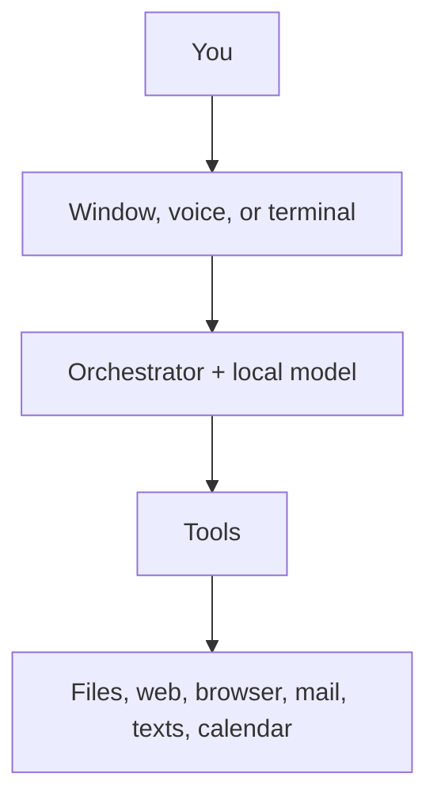

# Arelis

*(say it "ah-REL-is")*

Arelis is an assistant that lives on your own Windows PC. She has a desktop
window you talk or type into, she thinks using models running on your own
graphics card, and she can actually do things — read your files, search the
web, drive her own browser window, send mail and texts, keep your calendar,
remember what you told her last week, and keep named **rooms** for work that
lasts, each with its own conversation and folder.

The part that makes her different from a chatbot in a browser tab is where she
runs. There is no account. There is no server holding your conversations. If
your internet goes down, she still works.



## What Arelis will not do

This is the short version of a rule the code is built around: **nothing about
you leaves your machine unless you pointed it somewhere yourself.**

- No account, no sign-up, no profile on anyone's server.
- No analytics, no telemetry, no "anonymous" usage statistics.
- No crash report is sent anywhere. If something breaks, the logs stay on your
  disk; there is not yet a button that packages them up for you.
- Your conversations, contacts and memory are files on your disk. You can read
  them, back them up, or delete them, without asking anybody.

She reaches the internet when you asked her to: a web search, the weather, your
mail provider, a calendar you connected, your own phone. An installed copy also
asks GitHub once a day whether a newer version exists, sending only a
User-Agent that names the version it already is — that is unavoidable if the
question is "is there anything newer than this." A copy you run from source
never asks. The full list of hosts is pinned by a test, so a future change that
adds a new destination fails the build rather than shipping quietly.

She also asks before acting. Writing a file, sending a message, driving the
browser, remembering something permanently — each one shows a card, and nothing
happens until you allow it. She will not send texts or mail while you are away
from the keyboard.

## Installing

Arelis is a Windows program (64-bit Windows 10 or later). The usual way in is
the installer; building from source is below, for people changing the code.

### The installer

Download the latest setup from
[the GitHub releases page](https://github.com/sAnct1x/arelis/releases/latest).
The current file is `Arelis-0.2.1-win64-setup.exe`, about 155 MB to download
and about 640 MB once installed. It is per-user, into
`%LOCALAPPDATA%\Programs\Arelis`, and does not ask for administrator
permission.

The installer is **not code-signed.** Windows SmartScreen will warn on the
first run, and that warning is Windows doing its job, not a verdict on the
file. What a cautious person can check instead is the SHA-256 digest published
beside the installer on the same release (a small `.sha256` file). Download
both, then in PowerShell:

```powershell
Get-FileHash .\Arelis-0.2.1-win64-setup.exe -Algorithm SHA256
Get-Content .\Arelis-0.2.1-win64-setup.exe.sha256
```

The two hashes should match. That catches a truncated or corrupted download. It
is not a signature: both files come from the same release, so whoever could
replace one could replace the other. The trust anchor is HTTPS to GitHub.

The installer gives you Arelis, including voice and her browser extra. It does
not give you the models she thinks with. Those come from
[Ollama](https://ollama.com/download), which you install once, separately, and
which runs on your machine.

Get the models. This downloads several gigabytes, once. The 14B research model
wants most of a 12 GB graphics card; if yours is smaller, skip that pull and
she will still converse on the 7B.

```powershell
ollama pull qwen2.5:7b
ollama pull qwen2.5:14b
ollama pull qwen2.5-coder:7b
ollama pull nomic-embed-text
```

A vision model (`qwen2.5vl:3b`) is pulled the first time she looks at a
picture, so you do not have to fetch it up front. Ollama itself needs to be
running when you start her; if it is not, the title-bar chip says so.

Then run the setup. Start Arelis from the Start menu or the desktop shortcut
named **Arelis**. The first time she opens, she asks which folder she may work
in — details in [Where your things live](#where-your-things-live). An installed
copy looks for updates itself; a source checkout does not.

If you already ran Arelis from this repository, installing does **not** copy
that profile across. The two copies keep separate records on purpose. Moving
them is a deliberate copy, not something setup does.

How the installer is built, why it is unsigned, and how an installed copy
updates, are in [win-installer/README.md](win-installer/README.md).

### From source

You will need [Python 3.11 or newer](https://www.python.org/downloads/) and
Ollama, as above. Then:

```powershell
python -m venv .venv
.\.venv\Scripts\Activate.ps1
pip install -e .
```

Two optional extras, each worth having if you did not come in through the
installer (which already includes both):

```powershell
pip install -e ".[voice]"      # talking and listening
pip install -e ".[browser]"    # her own browser window
playwright install chromium
```

```powershell
.\scripts\run_ui.ps1
```

or just `arelis` once the environment is active. There is a terminal version
too, `arelis --cli`, and a background mode that keeps receiving your phone's
texts with no window open, `.\scripts\run_core.ps1`.

To put an icon on your desktop from a checkout:

```powershell
.\scripts\install_desktop_shortcut.ps1
```

That writes **Arelis (dev)** so it cannot overwrite the installed copy's
**Arelis** shortcut. The shortcut targets `pythonw.exe -m arelis` directly, so
no console window flashes on launch. Clicking it while she is hidden in the
tray raises the window rather than doing nothing.

## Where your things live

The first time you open the window, Arelis asks one question: which folder she
may work in. She can read, create, change and delete files inside it and nowhere
else, so it is worth reading the folder name before clicking. On an installed
copy the suggestion is `Documents\Arelis` — a folder of her own, so a mistake
ruins her workspace rather than your Documents. You can change it, or add more
folders, in Settings → Roots.

Your own records are kept somewhere else again, and the difference matters:

| | Where (installed) | What |
|---|---|---|
| The program | `%LOCALAPPDATA%\Programs\Arelis` | Arelis herself. Replaced when she updates. |
| Your records | `%LOCALAPPDATA%\Arelis` | Profile, contacts, mail login, memory, settings, logs, and the reports, screenshots and voice clips she makes for you |
| Her workspace | the folder you chose | Files she is allowed to read and edit |

Two reasons records and workspace are separate. Your contacts and mail password
should not sit in a folder you have granted a language model delete access to.
And keeping records outside the installation means updating Arelis cannot
discard them, and two people sharing a PC get two unrelated sets without Arelis
having any notion of accounts.

Running from a source checkout, records and workspace are both the repository
itself, so `data/` is where records go and everything below reads as it always
has. That is deliberate: it keeps a developer's history exactly where they left
it. An installed copy and a checkout on the same PC do not share a profile.

## Setting her up

Three files hold everything personal, and none of them are ever part of the
project. They live in `data/` under your records folder from the table above.
Copy the examples and fill in what you want:

| Copy this | To this | For |
|---|---|---|
| `data/profile.example.yaml` | `data/profile.yaml` | Your name, where you live, how you like answers |
| `data/contacts.example.yaml` | `data/contacts.yaml` | People she can text or email |
| `data/secrets.example.yaml` | `data/secrets.yaml` | Your mail login and similar |

The examples ship with Arelis; the filled-in versions stay on your disk and are
excluded from the project, so there is no way to commit them by accident.

## Using her

**The window.** With no conversation open you get the orbit — a ring with a
box under it. Type there. Once you send something you get the workbench: the
conversation, a composer at the bottom, and panels you can open for what she is
thinking, the files she is working with, your history, your contacts, and
notifications.

**Press F1** for every keyboard shortcut, and the version you are running.

**Rooms.** The general conversation is meant to be forgettable — cold launch
gives you an empty orbit, last night sits in History. Work you come back to
(a paper, a codebase, a three-week analysis) belongs in a **room**: a named
place with its own conversation thread, a purpose she is given every turn, and
the folder the work lives in. `/room physics` or "let's work on physics" goes
in; `/leave` comes out. You always start in the general orbit and step in on
purpose. [rooms.md](docs/rooms.md) is the full surface.

**Roles.** Three settings for how hard she thinks, switchable in the composer
or with `/role fast`, `/role research`, `/role code`. Only one model sits on
your graphics card at a time, so switching costs a few seconds.

| Role | Model | Good for |
|---|---|---|
| `fast` | `qwen2.5:7b` | Normal conversation |
| `research` | `qwen2.5:14b` | Harder questions |
| `code` | `qwen2.5-coder:7b` | Programming |

**Her browser.** She does not touch your everyday browser, with your tabs and
your logins. She has her own window that you watch while she works, with stop
and pause controls on the Arelis side. She never types a password or a
one-time code, and she never clicks Book, Pay or Checkout — those are yours.

**Voice.** Say **“Hey Arelis”** to start a conversation; a bare name does not
wake her. How that matching works, and how to read `logs/voice.log` when it
doesn't, is in [voice-wake.md](docs/voice-wake.md).

**Memory.** Things worth keeping live under Settings → Memory, and you can edit
or delete any of them. A dated backup lands in `data\backups\` beside your
records every time she starts, kept for a fortnight.

## What she can do

- Keep **rooms** — named project spaces with their own thread, folder and purpose
- Read and edit files in folders you have allowed
- Search the web and read pages properly, rather than guessing
- Drive her own browser: search, click, read a page, look something up on Maps
- Send mail, and email you a scheduled digest
- Keep a calendar, through Google, Outlook, or a plain local file
- Send and receive texts through your own Android phone
- Remember facts, goals and tasks, and give you a morning briefing
- Read text out of images and scanned documents
- Look at pictures and describe them, using a local vision model
- Resize, crop and adjust an existing picture on the machine, with no model
- Generate images, if you have ComfyUI set up separately
- Listen and speak (included in the installer; from source, with the voice extra)

An honest caveat: all of this is covered by tests, but some of it — voice
timing, texts through a real handset, image generation — has only been run
end to end on the author's own hardware. If something behaves oddly on yours,
that is worth an issue rather than an assumption that you did it wrong.

## Digging deeper

| Document | What it covers |
|---|---|
| [rooms.md](docs/rooms.md) | Named project spaces |
| [models.md](docs/models.md) | Which models she uses and why |
| [voice-wake.md](docs/voice-wake.md) | “Hey Arelis”, and what does not wake her |
| [browser-control.md](docs/browser-control.md) | Her browser, and the limits on it |
| [notify-inbound.md](docs/notify-inbound.md) | Getting your phone's texts to your PC |
| [calendar-oauth.md](docs/calendar-oauth.md) | Connecting a calendar |
| [architecture.md](docs/architecture.md) | How the whole thing is put together |
| [telemetry.md](docs/telemetry.md) | What gets logged, and where it stays |
| [win-installer/README.md](win-installer/README.md) | Building the installer, and how an installed copy updates |

## Contributing

See [CONTRIBUTING.md](CONTRIBUTING.md). To report a security hole, see
[SECURITY.md](SECURITY.md) and use the private report, not a public issue.
One rule matters more than the rest:
nothing that identifies a real person goes in this repository, including in
test fixtures. That is enforced by a test rather than by trust.

## Licence

Arelis is free software under the
[GNU Affero General Public License, version 3 or later](LICENSE).

In plain terms: you can use it, read it, change it and share it. If you share a
changed version — including by running it as a service other people connect to
— you have to make your changes available under the same licence. It cannot be
taken closed.
