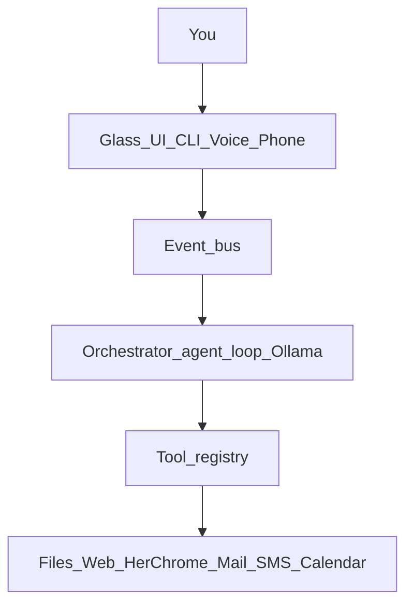
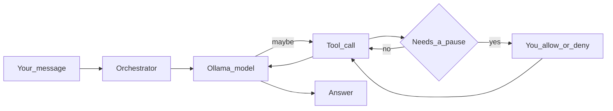

# How Arelis works

Install and day-to-day stay in the [README](../README.md).

## Big picture

You talk through a surface. Messages fly on an **event bus**. The **brain**
(orchestrator + agent loop + Ollama) decides what to say and which **tools** to
call. Tools reach the outside world.

## One turn

1. Your text (or voice transcript) hits the orchestrator.
2. The role model thinks — maybe it calls tools.
3. Risky actions pause for **allow / deny**. A drive you already asked for
   does not. Mail and texts always do.
4. Tool results go back into the turn; she answers with what she actually got.

If she invents a number or claim she cannot back up, finish gates can **refuse**
instead of sounding sure.

Native tool calling is the normal path. JSON fallback (a sticky-note
`{"tool":…}` / `{"final":…}` protocol) is only for when Ollama rejects the
tools array, or the **first** round is empty with no tool yet. If a tool
already succeeded this turn and the next round has empty chat content
(Qwen3.5 often puts the wrap-up in thinking), she **answers from that
result** instead of entering JSON mode. Writes and sends still wait on
allow / deny. Unknown invented names are still rejected.

### The card

The headline is human: *text wife*, *write note.txt*. Two lowercase
buttons. Deny is this step only. Conversation mode hears allow / deny
without starting a new turn. **Settings → Allow** is the list of what
pauses; **Systems ▾ → Allow gates** opens that tab. Mail, texts, and
calendar never ride along with **rest of this ask**. Living notes:
[whats-new.md](whats-new.md).

## Ways to run her

| How | When |
|-----|------|
| Glass UI (`.\scripts\run_ui.ps1`) | Normal — chat, docks, Settings |
| CLI (`arelis --cli`) | Same brain in a terminal |
| Core (`.\scripts\run_core.ps1`) | Background: phone ingest, jobs; no glass |
| Tray | UI hidden but still alive |

Core and UI talk over a small loopback bridge so inbound texts and “open the
window” still work when the glass is closed. Presence lives under
`arelis/presence/`.

## Glass UI

Empty session is the **orbit idle** face (`arelis/ui/void_idle.py`): warm void,
orbit ring, prompt under the orbit. The face stays locked to the window bloom
while idle. Typing stays there — the field grows and wraps; Enter sends
(Shift+Enter = newline). Once there is a thread (or a card / voice / a busy
turn), the **workbench** shows the transcript and a bottom composer. A smaller
dim orbit parks in the bottom-right.

While she drives **her** Chrome, a glass **Drive strip** sits above the
composer: **Arelis Chrome**, a status line (`about to click e3…`, `your turn —
captcha`), **Pause / Go**, **Stop**. Chrome itself stays looking like Chrome.

| Piece | Job |
|-------|-----|
| Composer | Idle: centered growing prompt. Workbench: bottom row + role picker (`fast` / `research`) |
| Title strip | **arelis** · view · settings · window buttons |
| Readiness | **Ollama** chip + **Systems ▾** (model pin, Allow gates, calendar / SMS / mail). Pulses when a confirm card is open. Allow gates opens Settings → Allow |
| Chat stage | Orbit idle or streaming answer, Sources, allow / deny cards |
| Drive strip | Stop / Pause / your-turn while a browser tool is in flight |
| Thinking dock | Status, tools, rounds, and a wrapping **think** paragraph (Qwen3.5 streams thinking one token per frame; those join instead of stacking as one-word lines) |
| Workspace dock | Roots, browse, open/save, editor, tool output |
| Camera dock | Webcam still → Point-and-Ask (LookGrant). View → camera / Ctrl+5 |
| History dock | Sessions; pending fact approve/reject |
| Notifications dock | Inbound SMS while the UI is open |
| Contacts | Named people for texts (View → contacts / Ctrl+6) |
| Settings | Audio / Window / Allow / Notify / Roots / Memory |

Docked instruments are type in the void (no fill plate). Floating tiles are
opaque — a translucent HWND composites chat through the plate (“ghost chat”).
Launch redocks saved floats.

Settings → Window can turn on **Collapse unused panels**. Off by default.
When on, History / Thinking / other instruments fold after 30, 45, or 60
minutes with no click, type, send, or wake word (mouse movement does not
count). Click or talk restores the same panels. Esc still peels them
immediately. A turn, an allow / deny card, latched talk/dictate, or Drive strip
delays rest. Launch still restores how you left the window.

Inbound SMS flashes the Arelis taskbar if you are in another window, and
the phone tile pulses when this process does not own the OS foreground.
The thread ends at the last bubble.

## The brain (code map)

| Piece | Path | Job |
|-------|------|-----|
| Bus | `arelis/core/bus.py` | Events between UI and brain |
| Orchestrator | `arelis/core/orchestrator.py` | One turn at a time; attachments |
| Agent loop | `arelis/core/agent_loop.py` | Model ↔ tools, confirms, finish rules |
| Skills / preflight | `arelis/core/skills.py`, `preflight.py`, `intent_catalog.py`, `look.py` | Weighted skill cards, one intent table, LookGrant |
| Router | `arelis/llm/` | Pick role model, warm/unload |
| Tools | `arelis/tools/` | Everything she can call |
| Browser | `arelis/browser/` | Her Chrome: launch, drive, walls, maps, search |
| UI | `arelis/ui/` | Void window, orbit, docks, Drive strip |
| Presence | `arelis/presence/` | Core, tray, IPC, readiness |
| Voice | `arelis/voice/` | STT + Kokoro/Piper TTS. Idle wake is **Hey Arelis** (compound phrase), then conversation. Spoken mail words are repaired (`in box` → inbox, `emile` → email). See [voice-wake.md](voice-wake.md). |
| Config | `arelis/config/default.yaml` | Defaults (overrides in `data/`) |

Only **one** chat model is meant to be in VRAM. Shipped **0.2.2** maps
`fast` / `research` to Qwen2.5 7B and 14B (the installer still also has a
code chip on coder 7B). This checkout (18 Aug 2026, not a release) dropped
the code role and overlays both remaining chips onto `qwen3.5:9b`;
`research` is a deeper loop on the same weights, not a second file. File
work stays on `fast`. Vision stays `qwen2.5vl:3b`. Thinking is on for both
chips. Tags and the local pin: [models.md](models.md). Static
system prefix is persona + `SKILL_CORE`
(byte-stable). Pure chat can skip tool schemas (`chat_fast_path`). Everyday
turns may shrink the tools array to matched skill cards
(`agent.skill_tool_subset`). Skill selection is weighted (phrases over tokens,
generic words demoted, negative hints veto a card); unmatched turns still fail
open. Same-round independent READ calls can run together
(`agent.read_fanout`); writes and pause-gated tools stay serial.

Launch STATUS `Inbound notify ready — Phone Notify URL: …` is thinking-dock
only. Painting it into chat used to mark the thread as started and hide the
orbit on a cold launch.

## Tools (short)

Registered in `arelis/tools/__init__.py`. Scheduled jobs leave out send, browser,
vision and the other tools that need a person present.

| Tool | Plain English | Pause? |
|------|---------------|--------|
| `web_search` | Find pages (DuckDuckGo HTML, then Lite, then Wikipedia) | No |
| `scrape` / `web_fetch` | Read a page or raw HTTP **for her**; RSS/Atom if the HTML is a shell | No |
| `research_report` | Multi-source write-up under `outputs/research/` | No* |
| `browser` | Drive **her** Chrome window | When she offers it. A drive you asked for is the grant |
| `workspace` | List / read / write files in allowed roots | Writes: yes |
| `analyze` / `doc_extract` / `git_info` | Tables, PDFs, git status | No |
| `calculator` | Exact math | No |
| `clipboard` / `ocr` / `vision` / `camera` | Paste, screen text, see an image (downscaled so a screenshot fits), webcam still | Yes (the still is free; seeing it pauses) |
| `memory` / `recall` / `tasks` / `goals` | Remember, chores, commitments; also answer "what needs my attention" | Mutates: yes |
| `inbox` / `send_email` / `schedule` | Read mail; send; timed jobs | Send: yes. Schedule writes: yes; `list` is free |
| `send_sms` / `inbound_sms` | Text out / list inbound | Send: yes |
| `agenda` | Calendar list/sync/create | Writes: yes |
| `weather` / `user_location` | Forecast for home or a named city / where she thinks you are | No |
| `image` | Generate a new picture via local ComfyUI | Yes |
| `image_edit` | Resize / crop / vibrance / contrast / brightness / sharpness on a file that exists (Pillow, no model) | Yes |
| `rooms` | Make or change a named project space | Create/change: yes |
| `contacts` | Named people for SMS | Mutates: yes |

\*Writes a local artifact; still logged. Outbound mail/SMS always need their own
allow / deny and are never batched with other tools.

### Browser vs scrape

Scrape reads a URL **for her** (no window). `browser` moves **her** Chrome
(`data/browser-profile/`), not your daily Chrome. You watch that window.
A JavaScript app that scrape cannot read is the same for every site: one nudge
to `browser(action=open)` on that URL. That offer still pauses for allow / deny.
A drive you already typed or said does not. She does not invent the page.

| Action | What it does |
|--------|----------------|
| `open` / `navigate` | Land a URL or alias in her window |
| `snapshot` | Click refs (buttons / links / fields) |
| `read` | Compact text of the tab she is on (untrusted) |
| `maps` | Google Maps directions + a phone-ready link |
| `search` | Google / YouTube / Amazon results in her window |
| `reserve` | OpenTable / Resy / Google — party/date/time in the URL; you click Book |
| `click` / `type` / `scroll` / `press` / `select` / `wait` | Drive like a person. Glow, then click. No passwords / OTP |
| `screenshot` | PNG under `outputs/images/` — then `vision` separately |
| `tabs` / `relaunch` | List/select tabs; restart **her** profile only |

A glass Drive strip is the cockpit. Captcha, sign-in, and Book / Pay / Checkout
freeze the drive — she does not solve puzzles or click the last button. Add to
cart is allowed. Reservations fill party / date / time; you click Book.
[browser-control.md](browser-control.md).

## Rooms

A **room** is a named place to work on one thing — its own conversation thread,
one workspace project, a purpose she is given every turn, and a model lean.
`/room physics` or "let's work on physics" goes in; `/leave` comes out. The
general conversation stays forgettable; rooms are where the work that lasts
lives. Definitions in `data/rooms.yaml`, threads in `memory.db` tagged with the
room. Full surface: [rooms.md](rooms.md).

## Memory and safety

- **Chat history** — sliding window (`agent.history_max_messages` = 24). History
  dock: sessions plus pending fact approve/reject.
- **Active facts** — `memory.db`; manage / forget in Settings → Memory.
- **Workspace roots** — only folders you configure. Writes wait on allow / deny.
- **Attachments** — paperclip / drag-drop stages copies under `data/drops/`.
- **Private URLs** — loopback / LAN blocked for model-supplied fetches.
- **Untrusted fetches** — scrape / web_fetch / search / inbox / inbound SMS /
  OCR / clipboard / browser `read` / vision are wrapped as *data, not instructions*.
  A later send or write in the same turn notes that on the card.
  A Point-and-Ask look mints a LookGrant (`can_act=false`): one still, one
  allow / deny, then stop — printed instructions cannot become a send.
- **Loop cap** — `agent.max_rounds` (default 8; research 12).
- **Ollama mid-turn death** — short line in chat; exception in Thinking.
- **Action ledger** — successful mutates append `data/action_ledger.jsonl`.
- **Memory backup** — dated copy in `data/backups/` (keeps 14 days).
- **CLI** — non-TTY writes denied unless `--allow-write`.

### Locks we keep on purpose

- Chat models stay **local** (Ollama). No paid cloud chat API.
- Calendar **APIs** (Google / Outlook) are the explicit cloud exception —
  [calendar-oauth.md](calendar-oauth.md). Tokens in gitignored `data/secrets.yaml`.
- No silent SMS or mail. No multi-agent swarm.
- No captcha solver. Co-op: she freezes, you tap, she continues.

## Files that matter

`data/`, `logs/`, `outputs/` and `models/` throughout these docs are relative to
the user data root, which is `%LOCALAPPDATA%\Arelis` for an installed copy and the
repository itself when running from source. Nothing mutable is ever written beside
the code: `site-packages` is unwritable for a standard user, is replaced by an
update, and is shared by every account on the machine. Resolve these through
`arelis/paths.py` rather than from the package location — `tests/test_user_data_dir.py`
enforces it.

Only `arelis/…` paths below are part of the installation.

| Path | Why |
|------|-----|
| `arelis/config/default.yaml` | Shipped defaults |
| `data/config.local.yaml` | Your overrides (gitignored) |
| `data/secrets.yaml` | Tokens (gitignored) |
| `data/profile.yaml` | Who/where you are |
| `data/rooms.yaml` | Your rooms — [rooms.md](rooms.md) |
| `data/memory.db` | Facts, goals, tasks |
| `data/backups/` | Dated `memory-YYYYMMDD.db` copies |
| `data/browser-profile/` | Her Chrome backpack |
| `logs/` | `arelis.log`, turns, events — [telemetry.md](telemetry.md) |
| `outputs/` | Research reports, images |

## Want more detail?

| Topic | Doc |
|-------|-----|
| What's new in this checkout | [whats-new.md](whats-new.md) |
| Rooms | [rooms.md](rooms.md) |
| Voice wake / listen | [voice-wake.md](voice-wake.md) |
| Models / VRAM | [models.md](models.md) |
| Browser | [browser-control.md](browser-control.md) |
| Phone texts | [notify-inbound.md](notify-inbound.md) |
| Calendar login | [calendar-oauth.md](calendar-oauth.md) |
| Logs | [telemetry.md](telemetry.md) |
| Building the installer | [win-installer/README.md](../win-installer/README.md) |
| Working on Arelis | [CONTRIBUTING.md](../CONTRIBUTING.md) |
