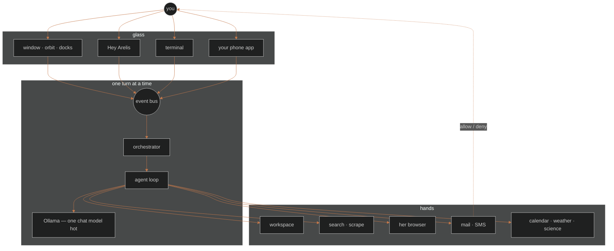
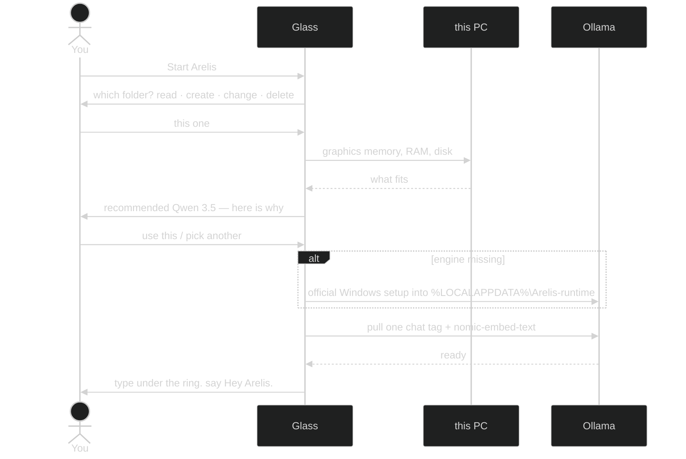
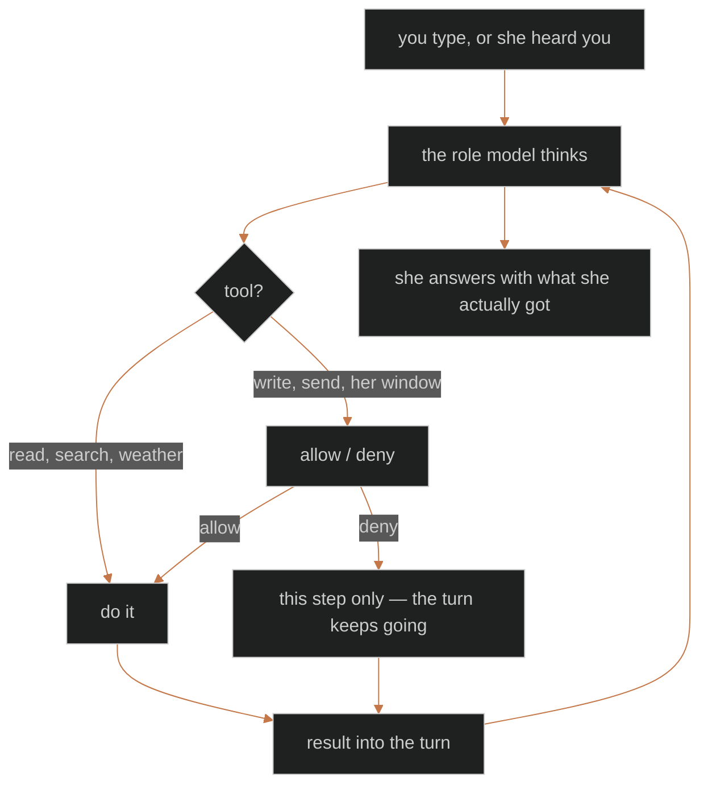
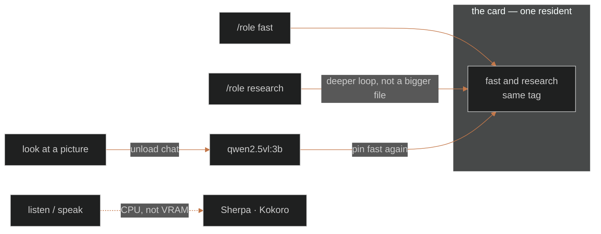

# 🗺️ How she is put together

Install and day-to-day stay in the [README](../README.md). Living notes
for this checkout: [whats-new.md](whats-new.md). This page is the map of
the house: rooms, wiring, and which door she is not allowed through.

## This PC, then the rest

Everything she *thinks* stays here. The rest of the world is a tool call
you started, or a card you allowed.

You talk through a surface. Messages fly on a small event bus. The brain
decides what to say and which tools to call. Tools reach the outside
world. Mail and texts do not go out on a hope.

## First open

Not a tour. Two glasses. The folder is a **permission**. The model is a
**recommendation**.

Pins both composer chips to that one tag in `config.local.yaml`. A copy
that already pinned `models.fast` is not asked again. Vision waits until
the first picture. Tags: [models.md](models.md).

## One turn

1. Your text (or a voice transcript) hits the orchestrator.
2. The role model thinks. It may call tools.
3. Risky actions pause. A drive you already asked for does not. Mail and
   texts always do.
4. Tool results go back into the turn. She answers with what she actually
   got.

If she invents a number she cannot back up, finish gates can refuse
instead of sounding sure.

Native tool calling is the normal path. JSON fallback is only for when
Ollama rejects the tools array, or the first round is empty with no tool
yet. If a tool already succeeded this turn and the next round has empty
chat content, she answers from that result instead of entering JSON
mode. Writes and sends still wait.

The card headline is human: *text wife*, *write note.txt*. Deny is this
step only. Conversation mode hears allow or deny without starting a new
turn. **Settings → Allow** is the list. Mail, texts, and calendar never
ride along with **rest of this ask**.

## Ways to run her

| How | When |
|-----|------|
| Glass UI (`.\scripts\run_ui.ps1`) | Normal: chat, docks, Settings |
| CLI (`arelis --cli`) | Same brain in a terminal |
| Core (`.\scripts\run_core.ps1`) | Background: phone ingest, jobs, no glass |
| Tray | UI hidden but still alive |

Core and UI talk over a small loopback bridge so inbound texts and
"open the window" still work when the glass is closed.

## Glass UI

Empty session is the orbit: warm void, a ring, a box under it. Typing
stays there until you send. Then you get the workbench: chat, composer,
docks.

| Piece | Job |
|-------|-----|
| Composer | Idle: centered prompt. Workbench: bottom row plus `fast` / `research` |
| Title strip | arelis, view, settings, window buttons |
| Readiness | Ollama chip and **Systems ▾** (model, Allow gates, calendar / SMS / mail) |
| Chat stage | Orbit, streaming answer, Sources, allow / deny cards |
| Drive strip | Stop / Pause / your-turn while her browser is in flight |
| Thinking dock | Status, tools, rounds, and a wrapping think paragraph |
| Workspace dock | Roots, files, tool output |
| Camera dock | Webcam still. View → camera / Ctrl+5 |
| History dock | Sessions, pending fact approve / reject |
| Notifications | Inbound SMS while the UI is open |
| Contacts | Named people for texts. View → contacts / Ctrl+6 |
| Settings | Audio / Window / Allow / Notify / Roots / Memory |

Settings → Window can fold unused panels after 30, 45, or 60 minutes
with no click, type, send, or wake word. Off by default. A turn, a card,
latched talk, or the Drive strip delays rest.

Inbound SMS flashes the taskbar if you are in another window. The phone
tile pulses when this process does not own the OS foreground.

The STATUS line about the Phone Notify URL lands in the thinking dock,
not chat. Painting it into chat used to hide the orbit on a cold launch.
Settings → Notify has the pairing QR.

## The brain

| Piece | Path | Job |
|-------|------|-----|
| Bus | `arelis/core/bus.py` | Events between UI and brain |
| Orchestrator | `arelis/core/orchestrator.py` | One turn at a time |
| Agent loop | `arelis/core/agent_loop.py` | Model, tools, confirms, finish rules |
| Skills | `arelis/core/skills.py` | Which tools she leans on |
| Router | `arelis/llm/` | Pick the role model, warm, unload |
| Setup | `arelis/setup/` | First open: hardware, one model, pull |
| Tools | `arelis/tools/` | Everything she can call |
| Browser | `arelis/browser/` | Her Chrome |
| UI | `arelis/ui/` | Window, orbit, docks |
| Presence | `arelis/presence/` | Core, tray, IPC |
| Voice | `arelis/voice/` | Listen and speak. [voice-wake.md](voice-wake.md) |
| Config | `arelis/config/default.yaml` | Defaults. Overrides in `data/` |

Only one chat model sits in graphics memory. First open recommends one
tag from hardware and pins both chips to it. Shipped last-resort in
`default.yaml` is `qwen3.5:9b` for fast and research. Research is a
deeper loop on the same weights. File work stays on fast. Vision stays
`qwen2.5vl:3b`. Tags: [models.md](models.md).

Everyday turns may shrink the tools array to matched skill cards.
Unmatched turns still fail open. Independent reads in the same round can
run together. Writes and pause-gated tools stay serial.

## Tools (short)

Registered in `arelis/tools/__init__.py`. Scheduled jobs leave out send,
browser, vision, plot, and the other tools that need a person present.
`cas`, `units`, and `catalog` may run unattended.

| Tool | Plain English | Pause? |
|------|---------------|--------|
| `web_search` | Find pages | No |
| `scrape` / `web_fetch` | Read a page for her | No |
| `research_report` | Multi-source write-up under `outputs/research/` | No* |
| `browser` | Drive her Chrome | When she offers it. A drive you asked for is the grant |
| `workspace` | Files in allowed roots | Writes: yes |
| `analyze` / `doc_extract` / `git_info` | Tables, PDFs, git | No |
| `calculator` | Arithmetic | No |
| `cas` / `units` | Closed forms, conversions, constants | No |
| `plot` | PNG under `outputs/plots/` | Yes |
| `catalog` | arXiv, Horizons; APOD / ADS after a free key | No |
| `clipboard` / `ocr` / `vision` / `camera` | Paste, screen text, see an image, webcam | Yes (the still is free; seeing it pauses) |
| `memory` / `recall` / `tasks` / `goals` | Remember, chores, "what needs my attention" | Mutates: yes |
| `inbox` / `send_email` / `schedule` | Mail and timed jobs | Send: yes. Schedule writes: yes; list is free |
| `send_sms` / `inbound_sms` | Text out / list inbound | Send: yes |
| `agenda` | Calendar | Writes: yes |
| `weather` / `user_location` | Forecast / where she thinks you are | No |
| `image` | New picture via local ComfyUI | Yes |
| `image_edit` | Resize and colour on a file that exists | Yes |
| `rooms` | Named project spaces | Create / change: yes |
| `contacts` | People for SMS | Mutates: yes |

\*Writes a local file. Outbound mail and SMS always need their own allow
/ deny and are never batched with other tools.

Scrape reads a URL for her, no window. `browser` moves her Chrome under
`data/browser-profile/`, not your daily Chrome. [browser-control.md](browser-control.md).

## Rooms

A room is a named place to work on one thing: its own thread, a folder,
a purpose she reads every turn. `/room physics` goes in. `/leave` comes
out. [rooms.md](rooms.md).

## Memory and safety

- Chat history is a sliding window (24 messages). History dock: sessions
  plus pending fact approve / reject.
- Active facts live in `memory.db`. Manage them in Settings → Memory.
- Workspace roots are only folders you configure. Writes wait.
- Attachments stage copies under `data/drops/`.
- Loopback and LAN URLs are blocked for model-supplied fetches.
- Scrape, search, inbox, inbound SMS, OCR, clipboard, browser `read`,
  and vision are wrapped as data, not instructions.
- A Point-and-Ask look mints a LookGrant: one still, one allow / deny,
  then stop. Printed instructions cannot become a send.
- Loop cap: `agent.max_rounds` (8; research 12).
- Successful mutates append `data/action_ledger.jsonl`.
- Memory backups: dated copies in `data/backups/` for 14 days.
- CLI non-TTY writes are denied unless `--allow-write`.

Chat models stay local (Ollama). No paid cloud chat API. Calendar APIs
are the explicit cloud exception: [calendar-oauth.md](calendar-oauth.md).
No silent SMS or mail. No captcha solver.

## Files that matter

`data/`, `logs/`, `outputs/`, and `models/` are under the user data root:
`%LOCALAPPDATA%\Arelis` installed, the repository from source. Resolve
them through `arelis/paths.py`. `tests/test_user_data_dir.py` enforces
it.

| Path | Why |
|------|-----|
| `arelis/config/default.yaml` | Shipped defaults |
| `data/config.local.yaml` | Your overrides (gitignored) |
| `data/secrets.yaml` | Tokens (gitignored) |
| `data/profile.yaml` | Who and where you are |
| `data/rooms.yaml` | Your rooms |
| `data/memory.db` | Facts, goals, tasks |
| `data/backups/` | Dated memory copies |
| `data/browser-profile/` | Her Chrome backpack |
| `logs/` | [telemetry.md](telemetry.md) |
| `outputs/` | Research, images, plots |

Privacy claims you can check: `tests/test_egress.py`.
