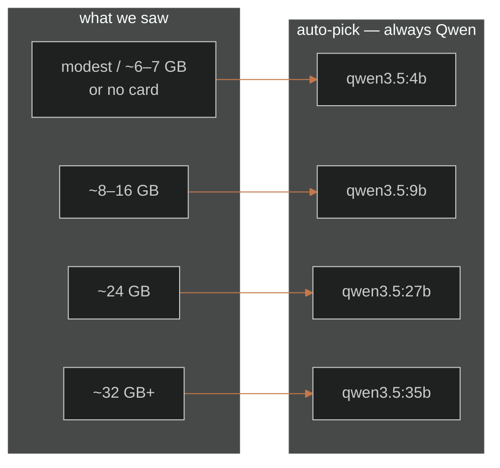

# Models — the brain on this PC

Arelis thinks with models that live on **this** machine, through
[Ollama](https://ollama.com/download). Nothing is sent to a paid chat
API. Only one chat model is hot at a time — the card is not a buffet.

Ollama is system-wide. An installed copy and a source checkout share the
same tags. Do not `ollama rm` a tag another copy on this PC still names.

## First open names a brain

A new copy looks at this PC (graphics memory, RAM, disk) and recommends
**one** chat model, with a why you can read. Confirm it, or pick another.
Whatever you confirm is both `fast` and `research`. No toys, no cloud
tags, no 671B.

The auto-pick is the largest **Qwen 3.5** that fits the card. That is
what we run every day, not a beauty contest. Gemma and DeepSeek are in
the list; they are never the auto-pick. Gemma 4 12B sat thinking for
minutes on a two-tool turn on a 12 GB card. DeepSeek is opt-in reasoning.



| This PC | Auto-pick |
|---------|-----------|
| Modest laptop / ~6–7 GB or no card | `qwen3.5:4b` |
| ~8–16 GB | `qwen3.5:9b` |
| ~24 GB | `qwen3.5:27b` |
| ~32 GB+ | `qwen3.5:35b` |

With no dedicated card, the recommendation stays on 4B or 9B even if
system RAM could hold a 27B. That machine would crawl.

If Ollama is not installed, setup downloads the official Windows engine
(~1.4 GB) into `%LOCALAPPDATA%\Arelis-runtime`, then pulls the chosen
tag plus `nomic-embed-text`. Tags land in the default Ollama store.

A copy that already pinned `models.fast` in `config.local.yaml` is not
asked again.

## Shipped last-resort (if setup has not run)

`arelis/config/default.yaml`:

| Role | Tag | What it actually is |
|------|-----|---------------------|
| `fast` | `qwen3.5:9b` | Day driver. Thinking on. File and git work stays here. |
| `research` | `qwen3.5:9b` | Same weights, thinking on. Deeper loop: more rounds, dual web hits, research tools, `num_ctx` 16384. |
| `vision` | `qwen2.5vl:3b` | Unload chat, one shot, pin fast again. |
| embed | `nomic-embed-text` | Recall / docs. |

Measured on an AMD box with about 12 GB, Ollama **0.32.14**: 9B soak
12/12 with zero parser 500s, tool-choice 30/30, foundation 13/13, about
5.62 GiB at 16384. Qwen2.5 7B was faster to first token but lost soak
fanout and tool-choice. Gemma 4 12B passed soak but spent about five
minutes thinking on a two-tool turn. Rejected as a daily driver.

The 14B dense niche is gone in Qwen3.5 (9B then 27B). A 27B offload was
not kept. 9B already beat 14B on the gates.

Selectable in setup (not auto-picked): Gemma 4 12B / 26B / 31B, DeepSeek
R1 8B / 14B / 32B / 70B.

A vision model is pulled the first time she looks at a picture if it is
not already local. Large screenshots are downscaled (long edge 1024 px)
first.

From source, without waiting for the glass:

```powershell
ollama pull qwen3.5:9b
ollama pull nomic-embed-text
ollama pull qwen2.5vl:3b
```

STT and TTS stay on CPU. Idle wake is faster-whisper until
`models/wake/hey_arelis.onnx` exists. Conversation and dictate are
Sherpa-ONNX Zipformer EN. TTS is Kokoro-82M `af_heart` (Piper Jenny
fallback). Details: [voice-wake.md](voice-wake.md).

Qwen3.5 streams native thinking one token per SSE frame. The thinking
dock joins those into one wrapping paragraph. That is UI, not a second
model.

## How VRAM is shared

One chat model in graphics memory. `/role research` does not swap
weights when both chips are the same tag. It changes the loop. After a
research turn she stays on that role for `router.rewarm_delay_s`
(default 60) so follow-ups do not pay a cold load, then pins `fast`
again. Same tag, so that pin is free.

Vision still unloads chat, runs one shot, then brings `fast` back.

Speech stays on the CPU.

## What 0.2.2 used

An installed 0.2.2 copy that has not been upgraded still has three chips:

| Role | Tag | Job |
|------|-----|-----|
| `fast` | `qwen2.5:7b` | Conversation, tools, texts |
| `research` | `qwen2.5:14b` | Deeper asks (8192 ctx) |
| `code` | `qwen2.5-coder:7b` | Edits / code |
| `vision` | `qwen2.5vl:3b` | See one local image |
| embed | `nomic-embed-text` | Recall / docs |

Those tags must stay on disk while 0.2.2 is still installed on this PC.

## What "best" would mean, and why it is not here

| Ambition | Why not |
|----------|---------|
| Best answers in the world | Paid cloud or 70B+, not 12 GB at usable speed |
| Speculative decoding | Ollama + Windows + AMD does not expose it |
| 27B on a 12 GB card | Offload. Gemma 12B already showed long think can beat "smarter" |
| Whisper `large-v3` | Steals the talk-feel on CPU |
| Thinking off on `fast` only | Possible (`think: false` on Ollama). Not wired. 9B with thinking on is the daily try |

How the router, rooms, and vision unload fit the rest:
[architecture.md](architecture.md).
